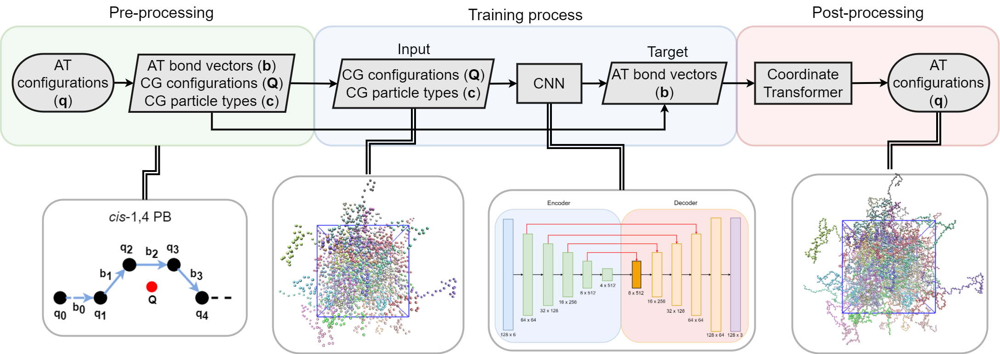

# CNN-BackMap-CG

Here we present a CNN approach for re-inserting atomistic detail to CG configurations.  
The method consists of three parts:
- Pre-processing: We extract the input (CG Cartesian coordinates (**Q**) and CG types (**c**)) and target output (atomistic bond vectors (**b**)) of the neural network, from atomistic Cartesian coordinates (**q**). 
- Training process: We train the model to give predictions from the probability distribution P(**b**|**Q**,**c**).
- Post-processing: We convert the predictions of the atomistic bond vectors to atomistic Cartesian coordinates (P(**b**|**Q**,**c**) to P(**q**|**Q**,**c**)).
## Method implementation
This directory contains files to perform:
- The training of the machine learning model.
- The testing of the model on unknown data (test-set).
- The visualization of the results (bond length, bond angle, and dihedral angle distributions).
## Generate samples
This directory contains a notebook, where we present the implementation of each part of the backmapping procedure.
 

